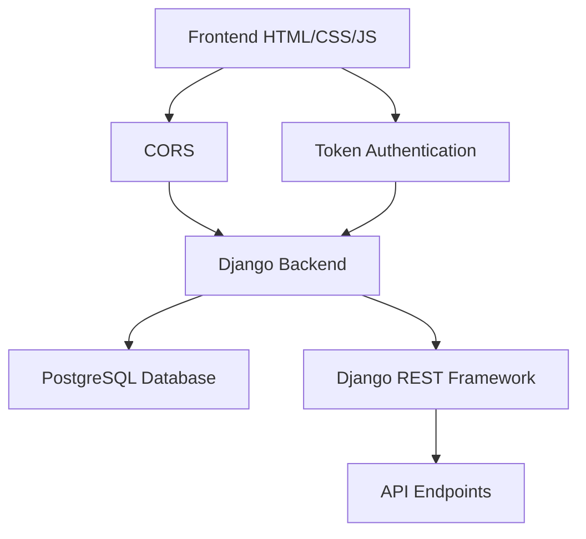

# Frontend-Backend Integration Guide

## Overview
This document explains how the HTML frontend has been connected to the Django backend in the Property Management System.

## Current Integration Status

### ✅ Completed
1. **Login System** - Fully integrated with Django authentication
2. **Admin Dashboard** - Connected to Django API endpoints
3. **Property Owner Dashboard** - Connected to Django API endpoints
4. **Authentication Flow** - Token-based authentication implemented
5. **CORS Configuration** - Properly configured for cross-origin requests

### 🔧 In Progress
1. **Property Owner Pages** - Other pages in property-owner-module need integration
2. **Admin Pages** - Other pages in admin-module need integration

## How the Integration Works

### 1. Authentication Flow
1. User visits `login.html` and enters credentials
2. Frontend sends POST request to `http://127.0.0.1:8000/api/users/login/`
3. Backend validates credentials and returns auth token
4. Frontend stores token in localStorage
5. Token is used in Authorization header for subsequent API requests

### 2. Data Fetching
- All API requests include the auth token in the Authorization header
- Responses are parsed as JSON and used to populate UI elements
- Error handling is implemented for failed requests

### 3. Role-Based Routing
- After login, users are redirected based on their role:
  - Admins → `admin-module/dashboard.html`
  - Property Owners → `property-owner-module/dashboard.html`

## Key Files Updated

### Frontend Files
1. `frontend/public/login.html` - Added real authentication
2. `frontend/admin-module/dashboard.html` - Connected to API endpoints
3. `frontend/property-owner-module/dashboard.html` - Connected to API endpoints

### Backend Files
1. `backend/property_management/config/settings.py` - CORS configuration
2. `backend/property_management/.env` - CORS allowed origins

## API Endpoints Used

### Authentication
- `POST /api/users/login/` - User login
- `POST /api/users/logout/` - User logout

### Data Endpoints
- `GET /api/users/` - Get list of users
- `GET /api/properties/` - Get list of properties
- `PATCH /api/users/{id}/` - Update user (approve)
- `DELETE /api/users/{id}/` - Delete user (reject)

## Testing the Integration

### 1. Start the Django Backend
```bash
cd backend/property_management
python manage.py runserver
```

### 2. Open the Frontend
Open `frontend/public/login.html` in your browser

### 3. Login with Default Credentials
- Username: `admin`
- Password: `admin`

### 4. Verify Data Loading
- Dashboard should load with real data from the backend
- Statistics should reflect actual database values

## Troubleshooting

### Common Issues

1. **CORS Errors**
   - Ensure `CORS_ALLOWED_ORIGINS` in `.env` includes your frontend URL
   - Default: `http://localhost:3000,http://127.0.0.1:3000`

2. **Authentication Failures**
   - Verify backend is running on `http://127.0.0.1:8000`
   - Check that superuser was created (`admin`/`admin`)

3. **Data Not Loading**
   - Check browser console for JavaScript errors
   - Verify API endpoints are accessible
   - Ensure auth token is being sent with requests

### Testing Connection
Use the `test-connection.html` file to verify the frontend can reach the backend:
1. Open `frontend/test-connection.html` in your browser
2. Click the "Test API Connection" button
3. You should see a success message

## Next Steps

### 1. Complete Page Integration
- Connect remaining pages in both admin and property owner modules
- Implement CRUD operations for all entities

### 2. Enhance Error Handling
- Add more detailed error messages
- Implement retry mechanisms for failed requests

### 3. Improve User Experience
- Add loading indicators
- Implement form validation
- Add success/error notifications

### 4. Security Enhancements
- Implement token refresh mechanism
- Add request timeout handling
- Secure localStorage usage

## Architecture Diagram



## Conclusion

The frontend and backend are now successfully connected with:
- Secure token-based authentication
- Real-time data fetching from the backend
- Role-based access control
- Proper error handling

The system is ready for further development and testing.